# URBANUS - Plataforma de Análise de Infraestrutura Urbana

> **Status:** Active
> This project is currently maintained.

Sistema para análise de redes viárias urbanas com processamento de grafos, enriquecimento de elevação e edição interativa de nós.

---

## Sumário

1. [Visão Geral](#1-visão-geral)
2. [Arquitetura do Sistema](#2-arquitetura-do-sistema)
3. [Estrutura do Projeto](#3-estrutura-do-projeto)
4. [Tipos de Dados e Interfaces](#4-tipos-de-dados-e-interfaces)
   - 4.1 [Tipos Geográficos](#41-tipos-geográficos)
   - 4.2 [Tipos de Nós (Nodes)](#42-tipos-de-nós-nodes)
   - 4.3 [Tipos de Ruas (Streets/Edges)](#43-tipos-de-ruas-streetsedges)
   - 4.4 [Tipos de Elevação](#44-tipos-de-elevação)
   - 4.5 [Tipos de Processamento de Grafo](#45-tipos-de-processamento-de-grafo)
5. [Regras de Validação de Nós](#5-regras-de-validação-de-nós)
   - 5.1 [Constantes e Limites](#51-constantes-e-limites)
   - 5.2 [Regras de Movimentação](#52-regras-de-movimentação)
   - 5.3 [Regras de Deleção](#53-regras-de-deleção)
   - 5.4 [Sistema de Snap](#54-sistema-de-snap)
   - 5.5 [Códigos de Erro](#55-códigos-de-erro)
6. [Regras de Validação de Ruas](#6-regras-de-validação-de-ruas)
   - 6.1 [Classificação de Vias (Highway Types)](#61-classificação-de-vias-highway-types)
   - 6.2 [Validação de Bounding Box](#62-validação-de-bounding-box)
   - 6.3 [Validação Pós-Processamento](#63-validação-pós-processamento)
7. [Algoritmos de Cálculo de Elevação](#7-algoritmos-de-cálculo-de-elevação)
   - 7.1 [Fluxo de Enriquecimento](#71-fluxo-de-enriquecimento)
   - 7.2 [Tipos de DEM Suportados](#72-tipos-de-dem-suportados)
   - 7.3 [Amostragem de Elevação](#73-amostragem-de-elevação)
   - 7.4 [Cálculo de Estatísticas](#74-cálculo-de-estatísticas)
   - 7.5 [Cálculo de Declividade (Slope)](#75-cálculo-de-declividade-slope)
8. [Algoritmos de Processamento de Grafo](#8-algoritmos-de-processamento-de-grafo)
   - 8.1 [Algoritmo de Subdivisão de Arestas](#81-algoritmo-de-subdivisão-de-arestas)
   - 8.2 [Interpolação de Elevação](#82-interpolação-de-elevação)
   - 8.3 [Classificação de Nós](#83-classificação-de-nós)
9. [Algoritmos Geográficos](#9-algoritmos-geográficos)
   - 9.1 [Distância Haversine](#91-distância-haversine)
   - 9.2 [Cálculo de Área](#92-cálculo-de-área)
   - 9.3 [Interpolação Linear](#93-interpolação-linear)
10. [Integrações com APIs Externas](#10-integrações-com-apis-externas)
    - 10.1 [Overpass API (OpenStreetMap)](#101-overpass-api-openstreetmap)
    - 10.2 [OpenTopography API](#102-opentopography-api)
11. [Rotas da API](#11-rotas-da-api)
    - 11.1 [Rotas do Frontend (Next.js)](#111-rotas-do-frontend-nextjs)
    - 11.2 [Rotas do Backend (FastAPI)](#112-rotas-do-backend-fastapi)
12. [Serviços (Services Layer)](#12-serviços-services-layer)
    - 12.1 [StreetsService](#121-streetsservice)
    - 12.2 [ElevationService](#122-elevationservice)
    - 12.3 [GraphProcessorService](#123-graphprocessorservice)
    - 12.4 [NodesService](#124-nodesservice)
    - 12.5 [BoundingBoxService](#125-boundingboxservice)
13. [Gerenciamento de Estado (State Management)](#13-gerenciamento-de-estado-state-management)
14. [Fluxo de Processamento Completo](#14-fluxo-de-processamento-completo)
15. [Configurações e Constantes](#15-configurações-e-constantes)
16. [Tratamento de Erros](#16-tratamento-de-erros)
17. [Stack Tecnológico](#17-stack-tecnológico)
18. [Comandos de Execução](#18-comandos-de-execução)
19. [Variáveis de Ambiente](#19-variáveis-de-ambiente)
20. [Limitações Conhecidas](#20-limitações-conhecidas)

---

## 1. Visão Geral

O URBANUS é uma plataforma de análise de infraestrutura urbana que permite:

- **Seleção de área** no mapa via bounding box (Shift + Drag)
- **Extração de ruas** do OpenStreetMap via Overpass API
- **Enriquecimento de elevação** via OpenTopography API (GeoTIFF)
- **Processamento de grafo** com subdivisão de arestas longas
- **Edição interativa de nós** com validação em tempo real
- **Persistência de projetos** em MongoDB

### Implementações

| Versão | Stack | Localização | Status |
|--------|-------|-------------|--------|
| Web (atual) | Next.js + FastAPI | `client/` + `server/` | Ativa |

---

## 2. Arquitetura do Sistema

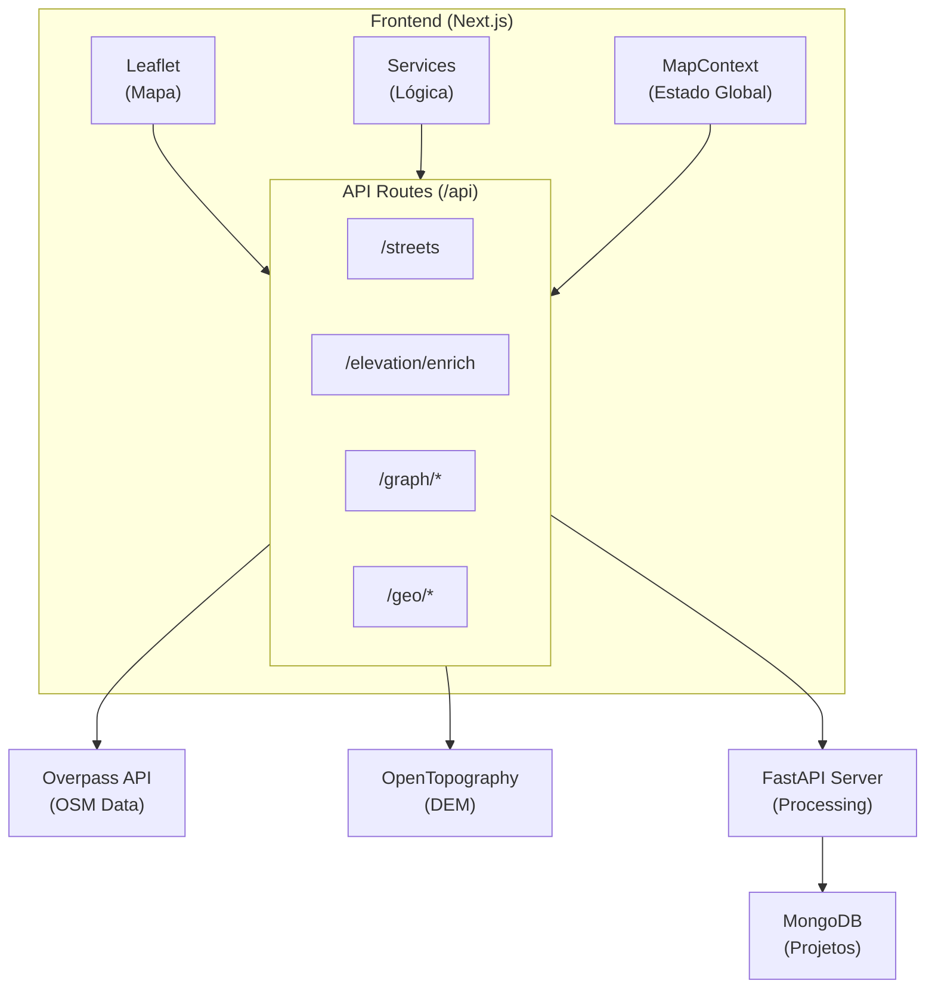

---

## 3. Estrutura do Projeto

### Diagrama de Componentes

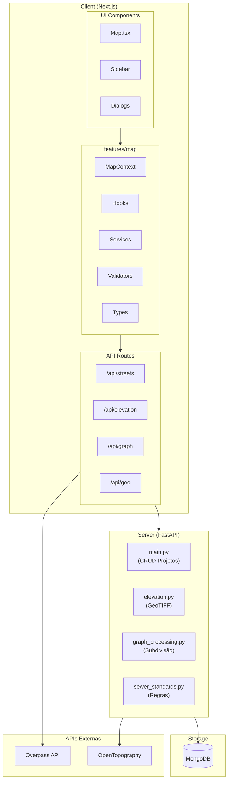

### Árvore de Diretórios

```
URBANUS/
├── client/                          # Frontend Next.js
│   ├── app/
│   │   ├── api/                     # API Routes
│   │   │   ├── streets/             # Fetch de ruas (Overpass)
│   │   │   ├── elevation/enrich/    # Proxy para elevação
│   │   │   ├── graph/analyze/       # Análise de grafo
│   │   │   ├── graph/process/       # Processamento de grafo
│   │   │   ├── geo/validate-bbox/   # Validação de bbox
│   │   │   └── geo/nodes/           # CRUD de nós
│   │   └── page.tsx                 # Página principal
│   ├── features/map/                # Módulo de mapa
│   │   ├── types/                   # Definições TypeScript
│   │   ├── validators/              # NodeValidator, BboxValidator
│   │   ├── services/                # Lógica de negócio
│   │   ├── hooks/                   # React hooks
│   │   ├── context/                 # MapContext (estado)
│   │   ├── components/              # Componentes UI
│   │   └── constants/               # Configurações
│   ├── components/                  # Componentes globais
│   └── stores/                      # Zustand stores
├── server/                          # Backend FastAPI
│   ├── main.py                      # App + CRUD de projetos
│   ├── elevation.py                 # GeoTIFF + enriquecimento
│   ├── graph_processing.py          # Subdivisão de grafos
│   └── sewer_standards.py           # Sistema de regras
└── docs/                            # Documentação
```

---

## 4. Tipos de Dados e Interfaces

### Diagrama de Relacionamento de Entidades

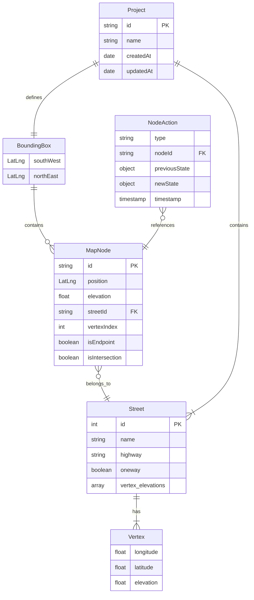

### 4.1 Tipos Geográficos

```typescript
// Coordenadas básicas
interface LatLng {
  lat: number;  // Latitude (-90 a 90)
  lng: number;  // Longitude (-180 a 180)
}

// Bounding Box (caixa delimitadora)
interface BoundingBox {
  southWest: LatLng;  // Canto inferior esquerdo
  northEast: LatLng;  // Canto superior direito
}

// Resultado de validação de Bbox
interface BboxValidationResult {
  isValid: boolean;
  errors: string[];
  warnings: string[];
  area?: number;  // km²
}
```

### 4.2 Tipos de Nós (Nodes)

```typescript
interface MapNode {
  id: string;                    // UUID único
  position: LatLng;              // Coordenadas do nó
  elevation: number | null;      // Elevação em metros (null se indisponível)
  streetId: string;              // ID da rua à qual pertence
  streetName?: string;           // Nome da rua (opcional)
  vertexIndex: number;           // Posição no array de coordenadas da LineString
  isEndpoint: boolean;           // true se é início ou fim da rua
  isIntersection?: boolean;      // true se conecta múltiplas ruas
  connectedStreets?: string[];   // IDs das ruas conectadas (para interseções)
  isSelected: boolean;           // Estado de seleção (UI)
  isHovered: boolean;            // Estado de hover (UI)
  isDragging: boolean;           // Estado de arrasto (UI)
  isLocked?: boolean;            // true se não pode ser editado
  createdAt: number;             // Timestamp de criação
  updatedAt: number;             // Timestamp de atualização
}

// Histórico de ações para undo/redo
interface NodeAction {
  type: "move" | "delete" | "create" | "batch";
  nodeId: string;
  previousState: Partial<MapNode>;
  newState: Partial<MapNode>;
  timestamp: number;
  batchActions?: NodeAction[];  // Para operações em lote
}

// Estado de seleção de nós
interface NodeSelectionState {
  selectedIds: Set<string>;
  hoveredId: string | null;
  lastSelectedId: string | null;
  selectionBbox: BoundingBox | null;  // Para seleção por região
}
```

### 4.3 Tipos de Ruas (Streets/Edges)

```typescript
// Feature GeoJSON de rua com propriedades enriquecidas
interface StreetFeature {
  type: "Feature";
  properties: {
    id: number;                          // ID da way no OSM
    name: string;                        // Nome da rua
    highway: HighwayType;                // Classificação da via
    surface?: string;                    // Tipo de pavimento
    lanes?: number;                      // Número de faixas
    maxspeed?: string;                   // Velocidade máxima
    oneway: boolean;                     // Se é mão única
    vertex_elevations?: (number | null)[]; // Elevação de cada vértice
    elevation?: StreetElevationData;     // Estatísticas de elevação
    max_slope?: number | null;           // Declividade máxima
  };
  geometry: {
    type: "LineString";
    coordinates: [number, number][];     // [longitude, latitude]
  };
}

// Tipos de vias suportados
type HighwayType =
  | "motorway"      // Autoestrada
  | "trunk"         // Via expressa
  | "primary"       // Via primária
  | "secondary"     // Via secundária
  | "tertiary"      // Via terciária
  | "residential"   // Via residencial
  | "unclassified"; // Não classificada
```

### 4.4 Tipos de Elevação

```typescript
// Dados de elevação de uma rua
interface StreetElevationData {
  min: number | null;     // Elevação mínima (metros)
  max: number | null;     // Elevação máxima (metros)
  avg: number | null;     // Elevação média (metros)
  range: number | null;   // Diferença max-min (metros)
  vertexElevations: (number | null)[];  // Elevação de cada vértice
  maxSlope: number | null;  // Maior variação entre vértices consecutivos
}

// Dados do raster de elevação
interface ElevationData {
  data: Float32Array;     // Valores do raster
  width: number;          // Largura em pixels
  height: number;         // Altura em pixels
  bbox: number[];         // [west, south, east, north]
  resolution?: {
    x: number;            // Metros por pixel (horizontal)
    y: number;            // Metros por pixel (vertical)
  };
  noDataValue?: number;   // Valor que representa ausência de dados
}

// Tipos de DEM disponíveis
type DEMType =
  | "COP30"     // Copernicus 30m (padrão)
  | "COP90"     // Copernicus 90m
  | "SRTMGL1"   // SRTM 30m
  | "SRTMGL3"   // SRTM 90m
  | "AW3D30"    // ALOS World 3D 30m
  | "NASADEM"   // NASA DEM
  | "EU_DTM"    // European DTM
  | "GEDI_L3";  // GEDI L3
```

### 4.5 Tipos de Processamento de Grafo

```typescript
// Opções de processamento
interface GraphProcessingOptions {
  maxEdgeLength: number;          // Comprimento máximo de aresta (metros)
  preserveElevations: boolean;    // Interpolar elevação em nós novos
  rules?: {
    maxSegmentLength?: number;    // Limite máximo (metros)
    minSegmentLength?: number;    // Limite mínimo (metros)
    minSlope?: number;            // Declividade mínima (m/m)
    maxSlope?: number;            // Declividade máxima (m/m)
  };
}

// Estatísticas de processamento
interface GraphProcessingStats {
  originalNodeCount: number;     // Nós antes do processamento
  newNodeCount: number;          // Nós adicionados
  processedEdges: number;        // Arestas que foram subdivididas
  skippedEdges: number;          // Arestas que não precisaram subdivisão
  processingTime: number;        // Tempo em milissegundos
}

// Resultado da análise prévia
interface GraphAnalysisResult {
  needsSubdivision: boolean;
  totalNodesNeeded: number;
  skippedEdges: number;
  totalEdges: number;
}
```

---

## 5. Regras de Validação de Nós

### 5.1 Constantes e Limites

```typescript
const NODE_CONSTRAINTS = {
  MIN_DISTANCE_METERS: 1,        // Distância mínima entre nós
  MAX_MOVE_DISTANCE_METERS: 500, // Movimento máximo permitido
  SNAP_DISTANCE_METERS: 5,       // Threshold para snap automático
};
```

### 5.2 Regras de Movimentação

| Regra | Condição | Resultado |
|-------|----------|-----------|
| **Nó Bloqueado** | `node.isLocked === true` | Erro: `NODE_LOCKED` |
| **Fora dos Limites** | Posição fora do `activeBbox` | Erro: `OUTSIDE_BOUNDS` |
| **Muito Próximo** | Distância < 1m de outro nó | Warning: `TOO_CLOSE` |
| **Movimento Grande** | Distância > 500m | Warning: `LARGE_MOVE` |
| **Interseção Modificada** | `node.isIntersection === true` | Warning: `INTERSECTION_MODIFIED` |

### 5.3 Regras de Deleção

| Regra | Condição | Resultado |
|-------|----------|-----------|
| **Nó Bloqueado** | `node.isLocked === true` | Erro: `NODE_LOCKED` |
| **Endpoint** | `node.isEndpoint === true` | Erro: `CANNOT_DELETE_ENDPOINT` |
| **Nó Não Encontrado** | Nó com ID inexistente | Erro: `NODE_NOT_FOUND` |

### 5.4 Sistema de Snap

Quando um nó é movido para uma posição dentro de `SNAP_DISTANCE_METERS` (5m) de outro nó:

1. O sistema sugere fazer snap para a posição do nó mais próximo
2. Se confirmado, o nó é movido para a posição exata do outro nó
3. Evita criação de nós duplicados em posições muito próximas

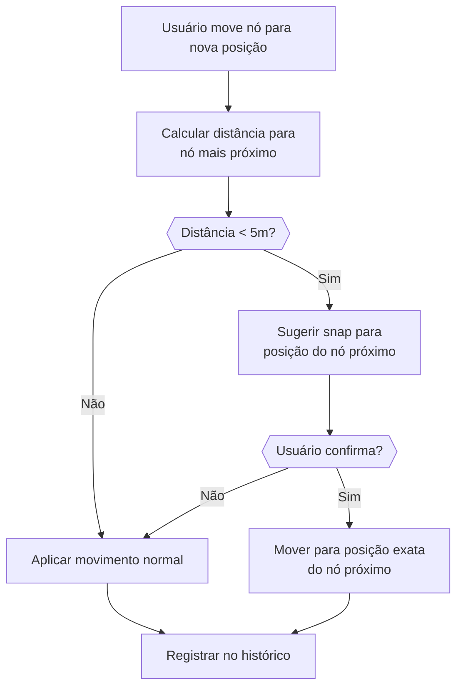

### 5.5 Códigos de Erro

```typescript
type NodeErrorCode =
  | "NODE_NOT_FOUND"          // Nó não existe
  | "NODE_LOCKED"             // Nó está travado
  | "CANNOT_DELETE_ENDPOINT"  // Não pode deletar endpoint
  | "OUTSIDE_BOUNDS"          // Posição fora da bbox
  | "INVALID_POSITION"        // Posição inválida (muito próximo)
  | "TOO_CLOSE"               // Warning: muito próximo
  | "LARGE_MOVE"              // Warning: movimento grande
  | "INTERSECTION_MODIFIED";  // Warning: interseção modificada
```

---

## 6. Regras de Validação de Ruas

### 6.1 Classificação de Vias (Highway Types)

| Tipo | Descrição | Faixas Padrão |
|------|-----------|---------------|
| `motorway` | Autoestrada | 4 |
| `trunk` | Via expressa | 4 |
| `primary` | Via primária | 3 |
| `secondary` | Via secundária | 3 |
| `tertiary` | Via terciária | 2 |
| `residential` | Via residencial | 2 |
| `unclassified` | Não classificada | 2 |

### 6.2 Validação de Bounding Box

| Validação | Limite | Erro |
|-----------|--------|------|
| **Latitude** | -90 a 90 | Coordenadas inválidas |
| **Longitude** | -180 a 180 | Coordenadas inválidas |
| **Área Mínima** | 0.001 km² | Área muito pequena |
| **Área Máxima** | 100 km² | Área muito grande |
| **Área Warning** | > 50 km² | Aviso de área grande |
| **Orientação** | south < north, west < east | Coordenadas invertidas |

### 6.3 Validação Pós-Processamento

Após o processamento de grafo, o sistema valida:

```python
checks = {
    "segmentCount": int,       # Total de segmentos processados
    "tooLong": int,            # Segmentos acima do máximo
    "tooShort": int,           # Segmentos abaixo do mínimo
    "belowMinSlope": int,      # Declividade abaixo do mínimo
    "aboveMaxSlope": int,      # Declividade acima do máximo
    "missingElevation": int,   # Segmentos sem elevação
}
```

---

## 7. Algoritmos de Cálculo de Elevação

### 7.1 Fluxo de Enriquecimento

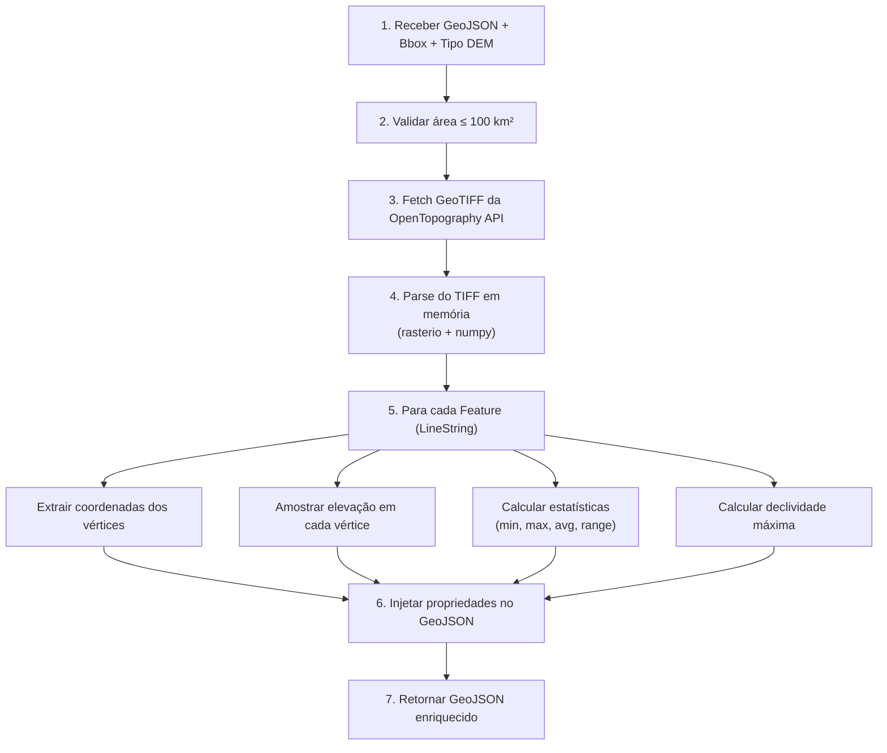

### 7.2 Tipos de DEM Suportados

| DEM | Resolução | Cobertura | Uso Recomendado |
|-----|-----------|-----------|-----------------|
| **COP30** | 30m | Global | Padrão (melhor qualidade) |
| COP90 | 90m | Global | Áreas grandes |
| SRTMGL1 | 30m | ±60° lat | Alternativa ao COP30 |
| SRTMGL3 | 90m | ±60° lat | Áreas grandes |
| AW3D30 | 30m | Global | Alta precisão |
| NASADEM | 30m | Global | NASA oficial |
| EU_DTM | Variável | Europa | Específico Europa |
| GEDI_L3 | Variável | Global | Dados LIDAR |

### 7.3 Amostragem de Elevação

```python
def _sample_elevations_at(src, coords, no_val):
    """
    Amostra elevação em cada coordenada.

    Parâmetros:
    - src: Dataset rasterio aberto
    - coords: Lista de (longitude, latitude)
    - no_val: Valor que representa ausência de dados

    Retorna:
    - Lista de float ou None para cada coordenada

    Lógica:
    1. Para cada (lng, lat):
       a. Converter para índice de pixel (row, col)
       b. Ler valor do raster nessa posição
       c. Se valor == no_val ou valor < -9000: retorna None
       d. Caso contrário: retorna valor float
    """
```

### 7.4 Cálculo de Estatísticas

```python
def _elevation_stats(elevations):
    """
    Calcula estatísticas de elevação.

    Entrada: [150.5, 152.3, None, 148.1, 155.0]

    Processo:
    1. Filtrar valores None
    2. Se lista vazia: retorna todos None

    Retorna:
    {
        "min": 148.1,    # Menor elevação
        "max": 155.0,    # Maior elevação
        "avg": 151.48,   # Média aritmética
        "range": 6.9     # max - min
    }
    """
```

### 7.5 Cálculo de Declividade (Slope)

```python
def _max_slope(elevations):
    """
    Calcula maior variação de elevação entre vértices consecutivos.

    Entrada: [150.0, 152.5, 148.0, 155.0]

    Processo:
    1. Para cada par consecutivo (e1, e2):
       - Se ambos não-None: calcular |e2 - e1|
    2. Retornar o maior valor encontrado

    Saída: 7.0 (de 148.0 para 155.0)

    Nota: Este valor é em metros, não em m/m.
    Para calcular slope em m/m, divide-se pela distância horizontal.
    """
```

**Fórmula de Slope (m/m):**

```
slope = |Δ elevação| / distância_horizontal

Onde:
- Δ elevação = |elevation₂ - elevation₁| em metros
- distância_horizontal = distância Haversine entre os pontos
```

---

## 8. Algoritmos de Processamento de Grafo

### 8.1 Algoritmo de Subdivisão de Arestas

O algoritmo principal divide arestas longas em segmentos menores:

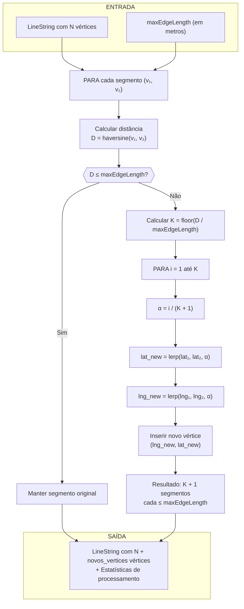

**Exemplo:**

```
Entrada:
  Segmento: A ────────────────────────── B
  Distância: 850m
  maxEdgeLength: 300m

Cálculo:
  K = floor(850 / 300) = 2 pontos intermediários

Saída:
  A ──── P₁ ──── P₂ ──── B

  Distâncias:
  A→P₁: ~283m
  P₁→P₂: ~283m
  P₂→B: ~284m
```

### 8.2 Interpolação de Elevação

Quando `preserveElevations = true`:

```python
def interpolate_elevation(elev1, elev2, alpha):
    """
    Interpola elevação linearmente.

    Parâmetros:
    - elev1: Elevação do ponto inicial
    - elev2: Elevação do ponto final
    - alpha: Fator de interpolação (0 a 1)

    Retorno:
    - Se ambos não-None: elev1 + alpha * (elev2 - elev1)
    - Se qualquer um é None: None

    Exemplo:
    elev1 = 100m, elev2 = 150m, alpha = 0.4
    resultado = 100 + 0.4 * (150 - 100) = 120m
    """
```

### 8.3 Classificação de Nós

```python
def classify_node(node_id, graph, original_count):
    """
    Classifica um nó por seu tipo.

    Retorna:
    - "intermediate": node_id >= original_count (nó novo)
    - "intersection": degree(node) >= 3
    - "regular": caso contrário
    """

    if node_id >= original_count:
        return "intermediate"  # Cor: verde/olive
    elif graph.degree(node_id) >= 3:
        return "intersection"  # Cor: violeta
    else:
        return "regular"       # Cor: azul claro
```

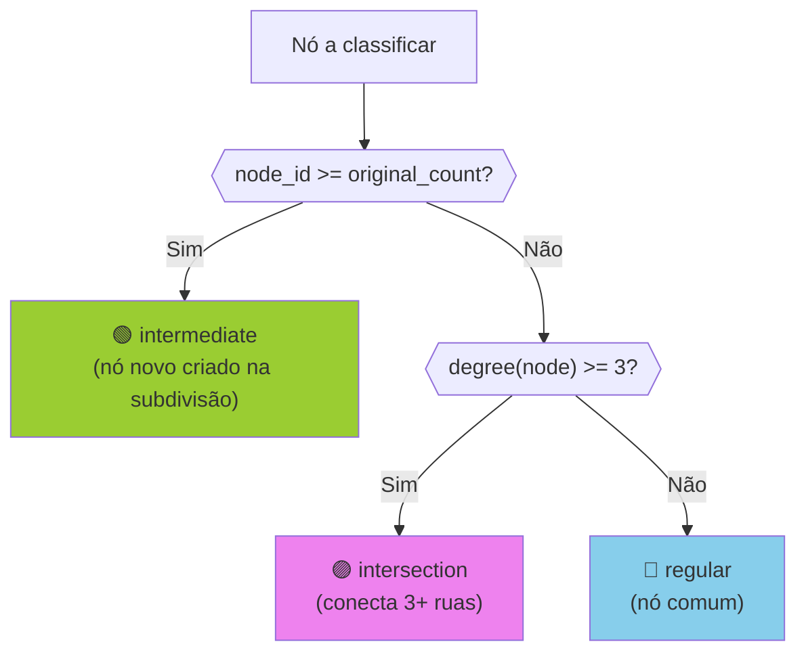

---

## 9. Algoritmos Geográficos

### 9.1 Distância Haversine

Calcula a distância geodésica entre dois pontos na superfície terrestre:

```python
def haversine_distance(lat1, lng1, lat2, lng2):
    """
    Calcula distância em metros usando fórmula Haversine.

    Fórmula:
    a = sin²(Δlat/2) + cos(lat1) × cos(lat2) × sin²(Δlng/2)
    c = 2 × atan2(√a, √(1-a))
    d = R × c

    Onde:
    - R = 6.371.000 metros (raio médio da Terra)
    - Δlat = lat2 - lat1 (em radianos)
    - Δlng = lng2 - lng1 (em radianos)

    Exemplo:
    São Paulo (-23.5505, -46.6333) → Rio (-22.9068, -43.1729)
    Resultado: ~357 km
    """
    R = 6371000  # metros

    lat1_rad = radians(lat1)
    lat2_rad = radians(lat2)
    delta_lat = radians(lat2 - lat1)
    delta_lng = radians(lng2 - lng1)

    a = sin(delta_lat/2)**2 + cos(lat1_rad) * cos(lat2_rad) * sin(delta_lng/2)**2
    c = 2 * atan2(sqrt(a), sqrt(1-a))

    return R * c
```

### 9.2 Cálculo de Área

Calcula a área aproximada de um bounding box em km²:

```python
def calculate_area_km2(south, north, west, east):
    """
    Calcula área aproximada de um bbox em km².

    Fórmula:
    - km_per_deg_lat = 111.32 (constante)
    - km_per_deg_lng = 111.32 × cos(lat_média)
    - área = Δlat × km_per_deg_lat × Δlng × km_per_deg_lng

    Exemplo:
    bbox = (-23.6, -23.5, -46.7, -46.6)  # ~0.1° × 0.1°
    lat_média = -23.55
    km_per_deg_lng = 111.32 × cos(-23.55°) ≈ 102.1
    área ≈ 0.1 × 111.32 × 0.1 × 102.1 ≈ 113.6 km²
    """
    avg_lat = (north + south) / 2
    km_per_deg_lat = 111.32
    km_per_deg_lng = 111.32 * cos(radians(avg_lat))

    delta_lat = north - south
    delta_lng = east - west

    return delta_lat * km_per_deg_lat * delta_lng * km_per_deg_lng
```

### 9.3 Interpolação Linear

```python
def lerp(a, b, alpha):
    """
    Interpolação linear entre dois valores.

    Fórmula: resultado = a + α × (b - a)

    Parâmetros:
    - a: Valor inicial
    - b: Valor final
    - alpha: Fator de interpolação [0, 1]

    Exemplos:
    lerp(0, 100, 0.0) = 0
    lerp(0, 100, 0.5) = 50
    lerp(0, 100, 1.0) = 100
    lerp(10, 30, 0.25) = 15
    """
    return a + alpha * (b - a)
```

---

## 10. Integrações com APIs Externas

### Diagrama de Sequência: Fetch de Ruas

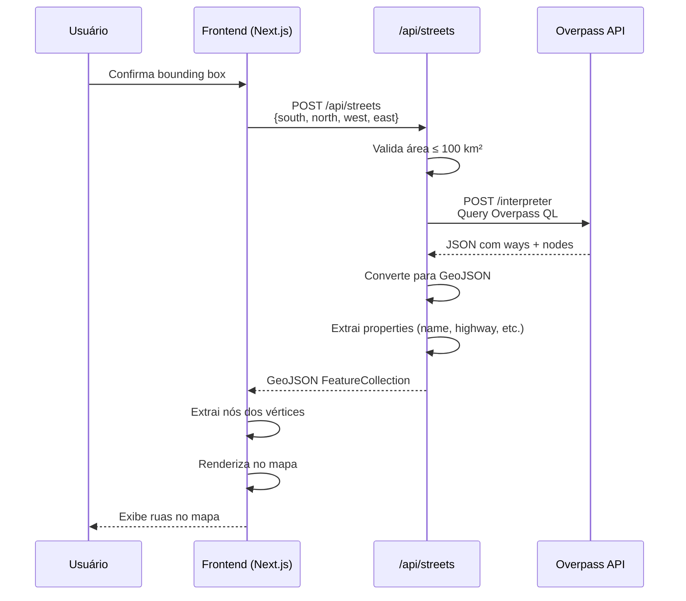

### Diagrama de Sequência: Enriquecimento de Elevação

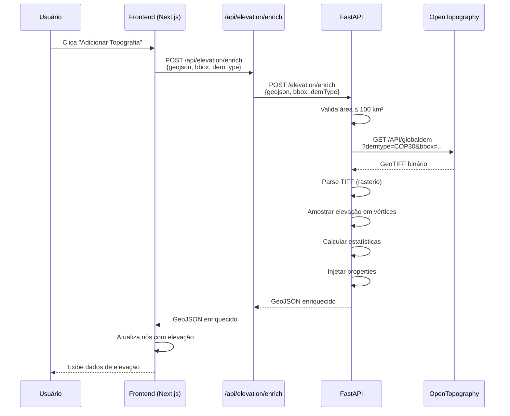

### 10.1 Overpass API (OpenStreetMap)

**Endpoint:** `https://overpass-api.de/api/interpreter`

**Método:** POST

**Query Overpass QL:**

```
[out:json][timeout:30];
(
  way["highway"~"^(motorway|trunk|primary|secondary|tertiary|residential|unclassified)$"]
  (SOUTH,WEST,NORTH,EAST);
);
out body;
>;
out skel qt;
```

**Parâmetros:**

| Campo | Tipo | Descrição |
|-------|------|-----------|
| `out:json` | Formato | Saída em JSON |
| `timeout:30` | Segundos | Timeout da query |
| `highway` | Regex | Tipos de via filtrados |
| `SOUTH,WEST,NORTH,EAST` | Float | Bounding box |

**Resposta:**

```json
{
  "elements": [
    {
      "type": "node",
      "id": 123456,
      "lat": -23.5505,
      "lon": -46.6333
    },
    {
      "type": "way",
      "id": 789012,
      "nodes": [123456, 123457, ...],
      "tags": {
        "name": "Avenida Paulista",
        "highway": "primary",
        "lanes": "4",
        "oneway": "yes"
      }
    }
  ]
}
```

**Conversão para GeoJSON:**

1. Criar mapa de nodes: `{id: {lat, lng}}`
2. Para cada way:
   - Extrair coordenadas dos nodes referenciados
   - Criar LineString com coordenadas `[lng, lat]`
   - Extrair tags como properties

**Limite de Área:** 100 km² (validado antes da requisição)

**Rate Limiting:** 10 requisições por minuto

### 10.2 OpenTopography API

**Endpoint:** `https://portal.opentopography.org/API/globaldem`

**Método:** GET

**Parâmetros:**

| Parâmetro | Tipo | Descrição | Exemplo |
|-----------|------|-----------|---------|
| `demtype` | String | Tipo de DEM | `COP30` |
| `south` | Float | Latitude sul | `-23.6` |
| `north` | Float | Latitude norte | `-23.5` |
| `west` | Float | Longitude oeste | `-46.7` |
| `east` | Float | Longitude leste | `-46.6` |
| `outputFormat` | String | Formato de saída | `GTiff` |
| `API_Key` | String | Chave de autenticação | `xxx...` |

**Exemplo de URL:**

```
https://portal.opentopography.org/API/globaldem?
  demtype=COP30&
  south=-23.6&
  north=-23.5&
  west=-46.7&
  east=-46.6&
  outputFormat=GTiff&
  API_Key=YOUR_API_KEY
```

**Resposta:** GeoTIFF binário

**Processamento do GeoTIFF:**

```python
import rasterio
from io import BytesIO

# 1. Carregar em memória
with rasterio.open(BytesIO(response.content)) as src:
    # 2. Ler metadados
    transform = src.transform
    nodata = src.nodata

    # 3. Para cada coordenada (lng, lat):
    row, col = rasterio.transform.rowcol(transform, lng, lat)
    elevation = src.read(1)[row, col]

    # 4. Verificar nodata
    if elevation == nodata or elevation < -9000:
        elevation = None
```

**Limite de Área:** 100 km²

**Timeout:** 120 segundos

---

## 11. Rotas da API

### 11.1 Rotas do Frontend (Next.js)

| Rota | Método | Entrada | Saída | Descrição |
|------|--------|---------|-------|-----------|
| `/api/streets` | POST | `{south, north, west, east}` | GeoJSON FeatureCollection | Busca ruas no Overpass |
| `/api/elevation/enrich` | POST | `{geojson, bbox, demType?}` | GeoJSON enriquecido | Proxy para elevação |
| `/api/graph/analyze` | POST | `{geojson, maxEdgeLength}` | Estatísticas de análise | Preview de subdivisão |
| `/api/graph/process` | POST | `{geojson, options}` | GeoJSON + stats | Executa subdivisão |
| `/api/geo/validate-bbox` | POST | `{south, north, west, east}` | Resultado de validação | Valida bbox |
| `/api/geo/nodes` | POST | `{projectId, nodes[]}` | Success/Error | Salva nós (stub) |
| `/api/topography` | POST | `{bbox}` | GeoTIFF binário | Fetch direto de DEM |

### 11.2 Rotas do Backend (FastAPI)

| Rota | Método | Entrada | Saída | Descrição |
|------|--------|---------|-------|-----------|
| `/` | GET | - | `{"status": "ok"}` | Health check |
| `/projects` | POST | Project data | Project criado | Cria projeto |
| `/projects` | GET | - | Lista de projetos | Lista projetos |
| `/projects/{id}` | GET | - | Project | Busca projeto |
| `/projects/{id}` | DELETE | - | Success | Remove projeto |
| `/elevation/enrich` | POST | GeoJSON + bbox | GeoJSON enriquecido | Enriquece com elevação |
| `/graph/analyze` | POST | GeoJSON + options | Estatísticas | Analisa grafo |
| `/graph/process` | POST | GeoJSON + options | GeoJSON processado | Processa grafo |

---

## 12. Serviços (Services Layer)

### Diagrama de Classe dos Serviços

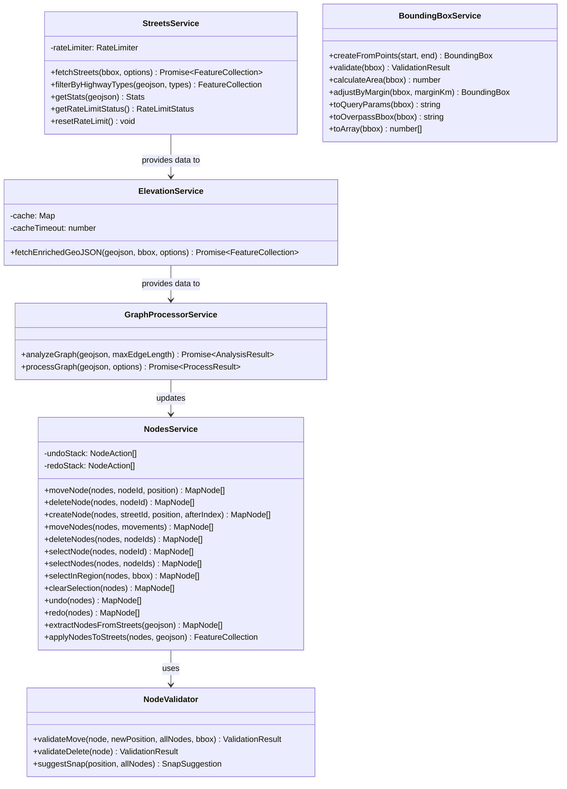

### 12.1 StreetsService

**Arquivo:** `client/features/map/services/StreetsService.ts`

**Responsabilidades:**
- Buscar ruas do Overpass API
- Filtrar por tipos de via
- Calcular estatísticas
- Gerenciar rate limiting

**Métodos:**

```typescript
class StreetsService {
  // Busca ruas com retry automático
  async fetchStreets(
    bbox: BoundingBox,
    options?: { retries?: number; highwayTypes?: HighwayType[] }
  ): Promise<GeoJSON.FeatureCollection>

  // Filtra GeoJSON por tipos de via
  filterByHighwayTypes(
    geojson: GeoJSON.FeatureCollection,
    types: HighwayType[]
  ): GeoJSON.FeatureCollection

  // Calcula estatísticas do GeoJSON
  getStats(geojson: GeoJSON.FeatureCollection): {
    totalStreets: number
    byType: Record<HighwayType, number>
    totalVertices: number
  }

  // Verifica status de rate limit
  getRateLimitStatus(): { remaining: number; resetAt: Date }

  // Reset de rate limit (para testes)
  resetRateLimit(): void
}
```

**Rate Limiting:**
- Máximo: 10 requisições por 60 segundos
- Retry automático com backoff exponencial: 2s, 4s, 8s
- Máximo 3 retries por padrão

### 12.2 ElevationService

**Arquivo:** `client/features/map/services/ElevationService.ts`

**Responsabilidades:**
- Fazer proxy de requisições de elevação
- Gerenciar cache de elevação
- Tratar erros e retries

**Métodos:**

```typescript
class ElevationService {
  // Enriquece GeoJSON com elevação
  async fetchEnrichedGeoJSON(
    geojson: GeoJSON.FeatureCollection,
    bbox: BoundingBox,
    options?: { demType?: DEMType }
  ): Promise<GeoJSON.FeatureCollection>
}
```

**Cache:**
- TTL: 30 minutos
- Máximo 10 entradas
- Chave: hash do bbox + demType

### 12.3 GraphProcessorService

**Arquivo:** `client/features/map/services/GraphProcessorService.ts`

**Responsabilidades:**
- Analisar necessidade de subdivisão
- Executar processamento de grafo
- Retornar estatísticas

**Métodos:**

```typescript
class GraphProcessorService {
  // Analisa grafo sem modificar
  async analyzeGraph(
    geojson: GeoJSON.FeatureCollection,
    maxEdgeLength: number
  ): Promise<GraphAnalysisResult>

  // Executa processamento
  async processGraph(
    geojson: GeoJSON.FeatureCollection,
    options: GraphProcessingOptions
  ): Promise<{
    geojson: GeoJSON.FeatureCollection
    stats: GraphProcessingStats
  }>
}
```

### 12.4 NodesService

**Arquivo:** `client/features/map/services/NodesService.ts`

**Responsabilidades:**
- CRUD de nós
- Seleção e multi-seleção
- Undo/Redo
- Sincronização com GeoJSON

**Métodos:**

```typescript
class NodesService {
  // ===== CRUD =====

  // Move um nó
  moveNode(
    nodes: MapNode[],
    nodeId: string,
    newPosition: LatLng
  ): MapNode[]

  // Deleta um nó
  deleteNode(nodes: MapNode[], nodeId: string): MapNode[]

  // Cria um nó intermediário
  createNode(
    nodes: MapNode[],
    streetId: string,
    position: LatLng,
    afterIndex: number
  ): MapNode[]

  // Operações em lote
  moveNodes(
    nodes: MapNode[],
    movements: Array<{ nodeId: string; newPosition: LatLng }>
  ): MapNode[]

  deleteNodes(nodes: MapNode[], nodeIds: string[]): MapNode[]

  // ===== SELEÇÃO =====

  selectNode(nodes: MapNode[], nodeId: string): MapNode[]
  selectNodes(nodes: MapNode[], nodeIds: string[]): MapNode[]
  toggleNodeSelection(nodes: MapNode[], nodeId: string): MapNode[]
  selectStreet(nodes: MapNode[], streetId: string): MapNode[]
  selectInRegion(nodes: MapNode[], bbox: BoundingBox): MapNode[]
  clearSelection(nodes: MapNode[]): MapNode[]
  getSelectedNodes(nodes: MapNode[]): MapNode[]

  // ===== UNDO/REDO =====

  undo(nodes: MapNode[]): MapNode[]
  redo(nodes: MapNode[]): MapNode[]
  canUndo(): boolean
  canRedo(): boolean
  getHistorySize(): { undoSize: number; redoSize: number }

  // ===== GeoJSON =====

  // Extrai nós do GeoJSON
  extractNodesFromStreets(
    geojson: GeoJSON.FeatureCollection
  ): MapNode[]

  // Aplica nós de volta ao GeoJSON
  applyNodesToStreets(
    nodes: MapNode[],
    geojson: GeoJSON.FeatureCollection
  ): GeoJSON.FeatureCollection
}
```

**Histórico de Undo/Redo:**
- Máximo 100 operações
- Stack limpo após nova ação pós-undo

### 12.5 BoundingBoxService

**Arquivo:** `client/features/map/services/BoundingBoxService.ts`

**Responsabilidades:**
- Criar bbox de dois pontos
- Validar bbox
- Calcular área
- Converter formatos

**Métodos:**

```typescript
class BoundingBoxService {
  // Cria bbox de dois cliques
  createFromPoints(start: LatLng, end: LatLng): BoundingBox

  // Validação completa
  validate(bbox: BoundingBox): BboxValidationResult

  // Calcula área em km²
  calculateArea(bbox: BoundingBox): number

  // Expande/contrai bbox
  adjustByMargin(bbox: BoundingBox, marginKm: number): BoundingBox

  // Conversões
  toQueryParams(bbox: BoundingBox): string
  toOverpassBbox(bbox: BoundingBox): string  // "south,west,north,east"
  toArray(bbox: BoundingBox): [number, number, number, number]
}
```

---

## 13. Gerenciamento de Estado (State Management)

### Diagrama de Estado: ViewMode

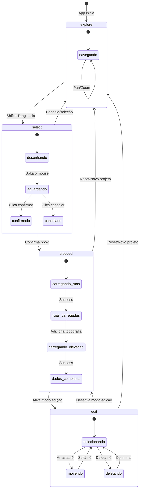

### Diagrama de Estado: Stages de Processamento

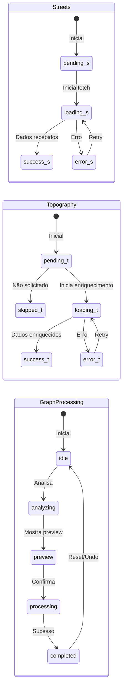

### MapContext (Estado Global)

**Arquivo:** `client/features/map/context/MapContext.types.ts`

```typescript
interface MapState {
  // ===== INSTÂNCIA DO MAPA =====
  map: L.Map | null;
  isReady: boolean;

  // ===== VIEWPORT =====
  viewMode: "explore" | "select" | "edit" | "cropped";
  center: [number, number];  // [lat, lng]
  zoom: number;

  // ===== BOUNDING BOX =====
  pendingBbox: BoundingBox | null;   // Sendo desenhado
  activeBbox: BoundingBox | null;    // Confirmado
  bboxArea: number;                  // km²

  // ===== PROCESSAMENTO =====
  isProcessing: boolean;
  stages: {
    streets: ProcessingStage;
    topography: ProcessingStage;
  };
  errors: {
    streets?: string;
    topography?: string;
  };

  // ===== DADOS =====
  streetsData: GeoJSON.FeatureCollection | null;
  streetCount: number;

  // ===== EDIÇÃO DE NÓS =====
  nodes: MapNode[];
  nodeEditMode: "none" | "select" | "move" | "delete" | "add";
  selectedNodeIds: string[];
  hoveredNodeId: string | null;

  // ===== UI =====
  showCropConfirm: boolean;
  showSaveDialog: boolean;
  validationError: string | null;
}

type ProcessingStage = "pending" | "loading" | "success" | "error" | "skipped";
```

**Actions (Dispatch):**

| Action | Payload | Descrição |
|--------|---------|-----------|
| `SET_MAP` | `L.Map` | Define instância Leaflet |
| `SET_PENDING_BBOX` | `BoundingBox` | Bbox sendo desenhado |
| `CONFIRM_BBOX` | - | Confirma bbox, muda para cropped |
| `CANCEL_BBOX` | - | Cancela bbox pendente |
| `SET_STREETS_DATA` | `FeatureCollection` | Define dados de ruas |
| `SET_NODES` | `MapNode[]` | Define array de nós |
| `SET_SELECTED_NODE_IDS` | `string[]` | Define seleção |
| `SET_NODE_EDIT_MODE` | `NodeEditMode` | Muda modo de edição |
| `SET_PROCESSING` | `boolean` | Estado de loading |
| `SET_STAGE` | `{stage, value}` | Estado de um stage |
| `SET_ERROR` | `{stage, error}` | Erro de um stage |
| `RESET` | - | Reset completo |

---

## 14. Fluxo de Processamento Completo

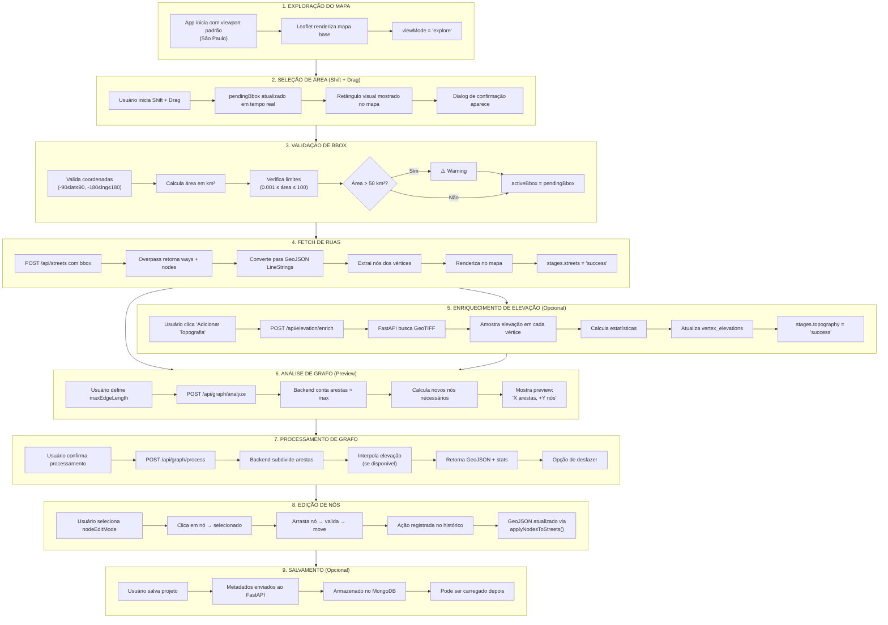

---

## 15. Configurações e Constantes

### Limites de Área

```typescript
const AREA_LIMITS = {
  MAX_BBOX_AREA_KM2: 100,           // Máximo permitido
  MIN_BBOX_AREA_KM2: 0.001,         // Mínimo permitido
  BBOX_AREA_WARNING_THRESHOLD: 50,  // Threshold para warning
};
```

### Constraints de Nós

```typescript
const NODE_CONSTRAINTS = {
  MIN_DISTANCE_METERS: 1,           // Distância mínima entre nós
  MAX_MOVE_DISTANCE_METERS: 500,    // Movimento máximo
  SNAP_DISTANCE_METERS: 5,          // Threshold de snap
};
```

### Rate Limiting

```typescript
const RATE_LIMITS = {
  STREETS_FETCH: {
    maxRequests: 10,
    windowMs: 60000,  // 1 minuto
  },
  TOPOGRAPHY_FETCH: {
    maxRequests: 5,
    windowMs: 60000,
  },
  NODE_OPERATIONS: {
    maxOps: 100,
    windowMs: 60000,
  },
};
```

### Cache de Elevação

```typescript
const ELEVATION_CACHE = {
  TTL_MS: 30 * 60 * 1000,  // 30 minutos
  MAX_ENTRIES: 10,
};
```

### Cores de Vias (UI)

```typescript
const HIGHWAY_COLORS: Record<HighwayType, string> = {
  motorway: "#e11d48",      // Vermelho
  trunk: "#f97316",         // Laranja
  primary: "#eab308",       // Amarelo
  secondary: "#22c55e",     // Verde
  tertiary: "#3b82f6",      // Azul
  residential: "#8b5cf6",   // Roxo
  unclassified: "#6b7280",  // Cinza
};
```

### Estilos de Nós (UI)

```typescript
const NODE_STYLES = {
  default: { radius: 6, color: "gray" },
  endpoint: { radius: 8, color: "amber" },
  selected: { radius: 10, color: "blue" },
  hovered: { radius: 9, color: "violet" },
  dragging: { radius: 11, color: "green" },
  invalid: { radius: 10, color: "red" },
  intermediate: { radius: 7, color: "green" },  // Nós novos do processing
};
```

---

## 16. Tratamento de Erros

### Erros de Operação de Nós

| Código | Descrição | Ação |
|--------|-----------|------|
| `NODE_NOT_FOUND` | Nó não existe | Recarregar nós |
| `NODE_LOCKED` | Nó está travado | Desbloquear ou ignorar |
| `CANNOT_DELETE_ENDPOINT` | Tentativa de deletar endpoint | Informar usuário |
| `OUTSIDE_BOUNDS` | Posição fora da bbox | Ajustar posição |
| `INVALID_POSITION` | Posição inválida | Sugerir snap |

### Erros de Fetch de Ruas

| Código | Descrição | Retry |
|--------|-----------|-------|
| `FETCH_ERROR` | Erro de rede/API | Sim |
| `RATE_LIMITED` | Rate limit excedido | Sim (com backoff) |
| `PARSE_ERROR` | Resposta inválida | Sim |
| `UNKNOWN_ERROR` | Erro desconhecido | Não |

### Erros de Elevação

| Código | Descrição | Retry |
|--------|-----------|-------|
| `FETCH_ERROR` | Falha na API | Sim |
| `RATE_LIMITED` | Rate limit excedido | Sim |
| `PROCESSING_ERROR` | Erro no servidor | Sim |
| `INVALID_DEM` | DEM inválido | Não |

### Erros de Processamento de Grafo

| Código | Descrição | Ação |
|--------|-----------|------|
| `INVALID_MAX_EDGE_LENGTH` | maxEdgeLength ≤ 0 | Corrigir parâmetro |
| `MISSING_GEOJSON` | GeoJSON não fornecido | Verificar dados |
| `PROCESSING_FAILED` | Erro no backend | Retry ou reportar |

### Estratégia de Retry

```typescript
const RETRY_STRATEGY = {
  maxRetries: 3,
  baseDelay: 2000,           // 2 segundos
  backoffMultiplier: 2,      // Exponencial
  retryableErrors: [
    "FETCH_ERROR",
    "RATE_LIMITED",
    "PARSE_ERROR",
    "PROCESSING_ERROR",
  ],
};

// Delays: 2s, 4s, 8s
```

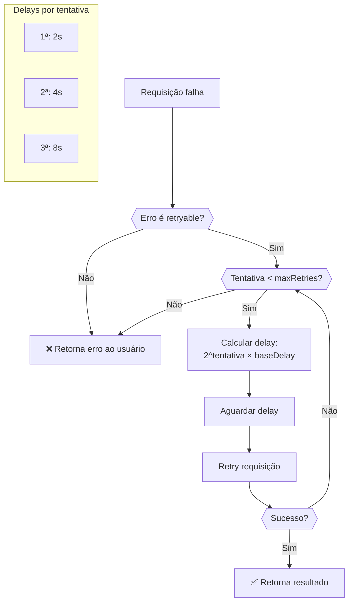

---

## 17. Stack Tecnológico

### Diagrama da Stack

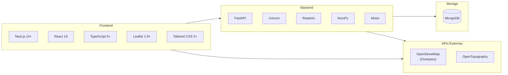

### Frontend

| Tecnologia | Versão | Uso |
|------------|--------|-----|
| Next.js | 14+ | Framework React (App Router) |
| React | 19 | UI Library |
| TypeScript | 5+ | Tipagem estática |
| Leaflet | 1.9+ | Renderização de mapas |
| Tailwind CSS | 3+ | Estilização |
| pnpm | 8+ | Package manager |

### Backend

| Tecnologia | Versão | Uso |
|------------|--------|-----|
| FastAPI | 0.100+ | Framework web Python |
| Uvicorn | 0.22+ | Servidor ASGI |
| Motor | 3+ | MongoDB async driver |
| Rasterio | 1.3+ | Leitura de GeoTIFF |
| NumPy | 1.24+ | Operações numéricas |
| httpx | 0.24+ | HTTP client async |

### Banco de Dados

| Tecnologia | Uso |
|------------|-----|
| MongoDB | Armazenamento de projetos |

### APIs Externas

| API | Uso |
|-----|-----|
| Overpass API | Dados de ruas (OSM) |
| OpenTopography | DEMs (elevação) |

---

## 18. Comandos de Execução

### Frontend (Next.js)

```bash
cd client

# Instalar dependências
pnpm install

# Desenvolvimento
pnpm dev

# Lint
pnpm lint

# Build de produção
pnpm build

# Iniciar produção
pnpm start
```

### Backend (FastAPI)

```bash
cd server

# Criar virtualenv (opcional)
python -m venv venv
source venv/bin/activate  # Linux/Mac
# ou: venv\Scripts\activate  # Windows

# Instalar dependências
pip install -r requirements.txt

# Desenvolvimento
uvicorn main:app --reload --host 0.0.0.0 --port 8000

# Produção
uvicorn main:app --host 0.0.0.0 --port 8000 --workers 4
```

### Docker (Stack Completa)

```bash
# Build e iniciar todos os serviços
docker-compose up --build

# Em background
docker-compose up -d --build

# Parar
docker-compose down

# Ver logs
docker-compose logs -f
```

---

## 19. Variáveis de Ambiente

### Obrigatórias

| Variável | Descrição | Usado em |
|----------|-----------|----------|
| `OPENTOPOGRAPHY_API_KEY` | Chave da API OpenTopography | FastAPI, `/api/topography` |

### Opcionais

| Variável | Descrição | Default |
|----------|-----------|---------|
| `PYTHON_API_URL` | URL do FastAPI | `http://localhost:8000` |
| `MONGO_URL` | URL do MongoDB | `mongodb://localhost:27018/urbanus` |
| `NODE_ENV` | Ambiente | `development` |

### Exemplo `.env`

```bash
# .env (raiz do projeto)
OPENTOPOGRAPHY_API_KEY=your_api_key_here
PYTHON_API_URL=http://localhost:8000
MONGO_URL=mongodb://localhost:27018/urbanus
```

### Exemplo `.env.local` (Next.js)

```bash
# client/.env.local
OPENTOPOGRAPHY_API_KEY=your_api_key_here
PYTHON_API_URL=http://localhost:8000
```

---

## 20. Limitações Conhecidas

### Limitações Técnicas

| Limitação | Descrição | Impacto |
|-----------|-----------|---------|
| Área máxima | 100 km² | Constraint da OpenTopography API |
| Rate limiting | 10 req/min (Overpass) | Pode causar delays |
| Undo/Redo | Máximo 100 operações | Histórico antigo perdido |
| Elevação | Interpolação linear | Não considera terreno local |
| 3D | Não suportado | Apenas visualização 2D |

### Limitações de UX

| Limitação | Descrição |
|-----------|-----------|
| Collision detection | Validação pós-movimento, não previne colisão |
| Drag feedback | Sem preview de posição válida durante drag |
| Offline | Não funciona sem conexão |

### Hardcoded Values

| Local | Valor | Recomendação |
|-------|-------|--------------|
| `useProjectStore.ts` | `http://localhost:8000` | Usar env var |
| Vários | 100 km² | Centralizar em constante |

### Melhorias Futuras

1. **Performance:** WebAssembly/Rust para processamento de grafo
2. **Spatial Index:** KD-tree para proximity checks
3. **Rendering:** WebGL para muitos nós
4. **Cache:** Delta compression para undo/redo
5. **Offline:** Service Worker + IndexedDB

---

## Licença

Este projeto é proprietário e de uso interno.

---

## Contribuição

Consulte o arquivo `CONTRIBUTING.md` para diretrizes de contribuição.

---

*Documentação gerada em Fevereiro/2026*
