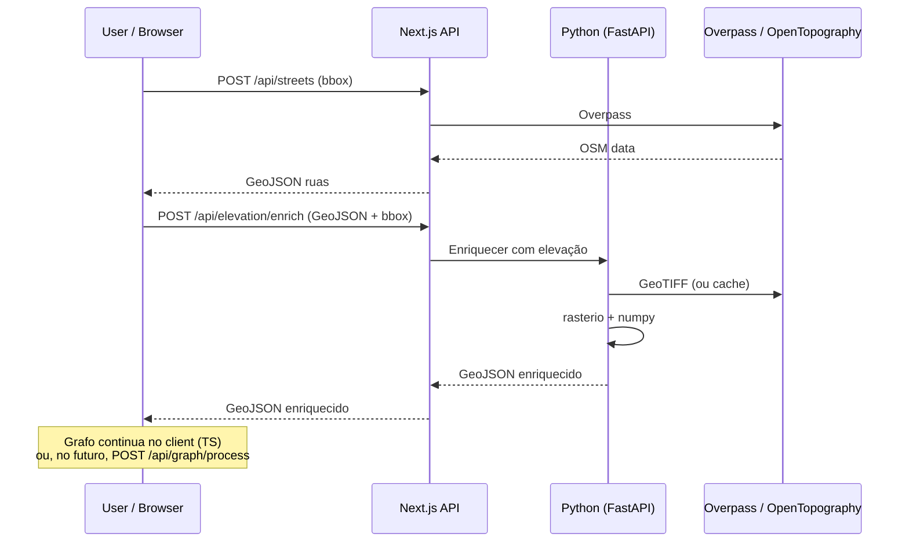

# Opções de Arquitetura para Otimização — URBANUS

Este documento analisa alternativas de arquitetura para otimizar o processamento de mapa, grafo, arestas e elevação no URBANUS, considerando **Tauri + Rust**, **Python server-side** e o cenário atual.

---

## 0. Implementação realizada (curto prazo)

**GeoTIFF e elevação foram movidos para o servidor Python.**

- **Python (FastAPI)**: `POST /elevation/enrich` — recebe GeoJSON + bbox (+ demType opcional), busca GeoTIFF no OpenTopography, enriquece com `rasterio` + `numpy`, retorna apenas GeoJSON enriquecido.
- **Next.js**: `POST /api/elevation/enrich` — proxy para o Python. Variável de ambiente `PYTHON_API_URL` (ex.: `http://localhost:8000` ou `http://server:8000` no Docker).
- **Client**: Removidos `geotiff.js`, `loadElevationData`, `enrichGeoJSONWithElevation` e fluxo de GeoTIFF no browser. O `ElevationService` chama apenas `POST /api/elevation/enrich`; o mapa usa o resultado diretamente.

---

## 1. Estado atual (pós-otimização)

### Onde o trabalho pesado está hoje

| Categoria | Onde roda | Stack | Observação |
|-----------|-----------|--------|------------|
| **GeoTIFF** | Client | `geotiff.js` (TS) | Download do blob + parse + rasters em memória no browser |
| **Elevação** | Client | `lib/geo/elevation.ts` | Lookup por vértice, bilinear, `enrichGeoJSONWithElevation` |
| **Grafo** | Client | `GraphProcessorService` (TS) | Subdivisão de arestas, interpolação, Haversine |
| **Geo** | Client | `lib/geo/calculations.ts` | Haversine, bbox, área, etc. |
| **Ruas** | Next.js API → Overpass | TS | Proxy + conversão OSM → GeoJSON |
| **Topografia** | Next.js API → OpenTopography | TS | Proxy; retorna GeoTIFF binário |
| **Projetos** | Python FastAPI + MongoDB | Python | Apenas CRUD; **nenhum** processamento de grafo/elevação |

Resumo: **todo o processamento pesado (GeoTIFF, elevação, grafo) está no frontend em TypeScript.** O servidor Python hoje só persiste projetos.

---

## 2. Gargalos principais (para otimizar)

1. **GeoTIFF no client**
   - Parse do TIFF + leitura de rasters (`Float32Array`) no JS.
   - Raster grande = muito uso de memória e CPU no browser.
   - `geotiff.js` é razoável, mas não tão eficiente quanto libs nativas.

2. **Enriquecimento com elevação**
   - Um lookup por vértice de cada `LineString` (nearest ou bilinear).
   - Milhares de vértices ⇒ milhares de acessos ao raster no client.
   - Tudo em JS, single-threaded.

3. **Processamento de grafo**
   - Loops sobre nós/arestas, Haversine, interpolação. Relativamente leve hoje.
   - Pode virar gargalo se escala subir muito (ex.: dezenas de milhares de arestas).

4. **Renderização**
   - Muitos `CircleMarker` no Leaflet podem pesar; a própria doc sugere Canvas/WebGL no futuro.

---

## 3. Opção A — Tauri + núcleo em Rust

### Ideia

- App desktop com Tauri (UI em web tech, backend em Rust).
- Lógica de **mapa, grafo, arestas e elevação** em Rust (incl. leitura de GeoTIFF, enriquecimento, subdivisão de arestas).

### Vantagens

- **Performance**: Rust é muito mais rápido que TS para loops numéricos, parsing binário e uso de memória.
- **Binário enxuto**: Sem Electron; menos consumo de RAM e disco.
- **Offline**: Tauri permite fluxo totalmente offline para processamento.
- **Segurança de tipos e memória**: Menos bugs de runtime em código crítico.

### Desvantagens

- **Perda do modelo “só web”**: Tauri é **desktop**. Se o produto for prioritariamente web (Vercel, etc.), você deixa de ter “um app só” na web.
- **Migração grande**: Reescrever GeoTIFF, elevação, grafo e geo em Rust + bindings Tauri.
- **Ecossistema geo em Rust**: Menos maduro que Python (rasterio, GDAL, etc.); há crates (ex.: `georaster`), mas o caminho é mais trabalhoso.
- **Duplicação se manter web**: Se continuar com Next.js para web, ou você mantém duas bases (TS + Rust) ou precisa de Rust também na web (ex.: WASM), o que complica o pipeline.

### Quando faz sentido

- **Foco em desktop**: app instalável, uso offline, usuários que rodam em máquina local.
- **Escala alta**: grafos enormes, muitos rasters, processamento que realmente sofre em JS.
- **Disposição para investir** em reescrita e em manter Rust + possível WASM.

---

## 4. Opção B — Processamento no servidor (Python)

### Ideia

- Manter **frontend em Next.js + React + Leaflet** como hoje.
- Mover **GeoTIFF, elevação e (se fizer sentido) grafo** para o **servidor Python** (FastAPI).
- APIs novas, por exemplo:
  - `POST /api/elevation/enrich` — recebe GeoJSON + bbox, devolve GeoJSON enriquecido.
  - `POST /api/graph/process` — recebe nós + opções, devolve grafo processado (opcional).

### Vantagens

- **Alto impacto com menor esforço**: Você já tem FastAPI; a migração é sobretudo “mover lógica” e criar endpoints.
- **Ecossistema geo em Python**: `rasterio`, `numpy`, `GDAL`, `networkx`, `shapely` são padrão para esse tipo de tarefa.
- **GeoTIFF no servidor**: Sem `geotiff.js` no client; o navegador só recebe GeoJSON já enriquecido.
- **Mais CPU/memória**: Servidor typically tem mais recursos que o browser; processamento pesado escala melhor.
- **Cache centralizado**: Dados de elevação e resultados podem ser cacheados no servidor (ex.: por bbox).

### Desvantagens

- **Latência**: Round-trip para enriquecer / processar. Dá para mitigar com cache e payloads enxutos.
- **Custo de servidor**: Mais CPU por usuário ativo.
- **Limite de área**: Você já limita bbox (ex.: 100 km²); isso continua válido.

### Quando faz sentido

- **Produto web-first** (que é o caso atual).
- **Otimização rápida**: tirar o pesado do client sem reescrever tudo em outra linguagem.
- **Manter uma única stack de processamento** (Python) bem conhecida no domínio geo.

---

## 5. Opção C — Rust via WebAssembly (WASM) no frontend

### Ideia

- Manter Next.js + React + Leaflet.
- Implementar **cálculos críticos** (geo, grafo, lookup de elevação) em **Rust** e compilar para **WASM**.
- O client chama funções WASM em vez de TS para esses trechos.

### Vantagens

- **Ganho de performance no browser** sem deixar de ser web.
- **Sem round-trip** para servidor para esses cálculos.
- **Reutilização**: O mesmo crate Rust pode, no futuro, alimentar Tauri se você for para desktop.

### Desvantagens

- **GeoTIFF**: O blob ainda é baixado e interpretado no client. Você pode usar Rust+WASM para o parse, mas o “peso” de processar raster no browser continua.
- **Curva de adoção**: Build (wasm-pack, etc.), integração com o bundler, debugar WASM.
- ** tamanho do bundle**: Módulo WASM adicional.

### Quando faz sentido

- Você quer **continuar 100% web** e **extrair mais performance** dos cálculos (geo, grafo, lookup).
- Ainda assim, **elevação em massa** (enriquecer muitas features) tende a ser mais eficiente no servidor, onde raster e numpy/rasterio são usados de forma nativa.

---

## 6. Recomendações (foco em otimização)

### Curto prazo (maior ganho / menor esforço)

**Mover elevação e GeoTIFF para o servidor Python.**

- **O que fazer**:
  1. No FastAPI (ou em um serviço separado que você chame a partir do Next.js):
     - Endpoint que recebe **GeoJSON** (ruas) + **bbox** (e talvez `demType`).
     - Servidor busca GeoTIFF (OpenTopography ou similar) **ou** usa um cache de rasters por região.
     - Usa `rasterio` + `numpy` para lookup (nearest/bilinear) e **enriquece o GeoJSON** no servidor.
     - Retorna **apenas o GeoJSON enriquecido** (com `vertex_elevations`, stats, etc.).
  2. No client:
     - Remover `geotiff.js` e a lógica de `loadElevationData` / `enrichGeoJSONWithElevation` para o fluxo principal.
     - Manter apenas chamada a `POST /api/elevation/enrich` (ou equivalente) e uso do resultado no mapa.

- **Por quê**:
  - Elimina o maior gargalo (parse + lookup de GeoTIFF no JS).
  - Aproveita Python + rasterio, que são muito mais eficientes para isso.
  - Menos memória e CPU no client; melhor experiência em dispositivos fracos.

### Médio prazo

- **Grafo**: Manter em TypeScript por enquanto. O `GraphProcessorService` é leve para o tamanho atual de dados. Se no futuro você tiver dezenas de milhares de arestas e isso virar gargalo, **aí** vale avaliar:
  - **Python**: `networkx` + endpoint `POST /api/graph/process`, ou
  - **Rust (WASM ou Tauri)**: se já estiverem investindo em Rust.
- **Ruas**: Manter como está (Overpass via Next.js API) está ok. Só eventualmente considerar cache (Redis, etc.) se o volume de consultas crescer.

### Longo prazo / se mudar o produto

- **Se o foco for desktop (instalável, offline)**: **Tauri + Rust** passa a fazer sentido. Nesse caso, um núcleo em Rust (geo, grafo, elevação) poderia ser usado tanto no Tauri quanto, se desejado, via WASM na web.
- **Se o foco permanecer web**: **Python no servidor** para elevação (e talvez grafo no futuro) tende a ser mais simples e eficiente do que Rust/WASM para esse tipo de carga.

---

## 7. Comparação rápida

| Critério | Tauri + Rust | Python server | Rust WASM (frontend) |
|----------|----------------|---------------|-----------------------|
| **Impacto na otimização** | Alto | **Alto (elevação)** | Médio (cálculos) |
| **Esforço de migração** | Alto | **Médio** | Médio–Alto |
| **Mantém app web** | Não (só desktop) | **Sim** | **Sim** |
| **GeoTIFF / elevação** | Rust (crates geo) | **rasterio/numpy** | Ainda no client |
| **Grafo** | Rust | Python networkx | Rust WASM |
| **Ecossistema geo** | Menos maduro | **Muito maduro** | Limitado ao que roda em WASM |

---

## 8. Fluxo sugerido (otimizado, web)

---

## 9. Conclusão

- **Para otimização com o menor custo hoje**: **mover GeoTIFF e elevação para o servidor em Python** (rasterio + numpy) e manter grafo em TS até precisar de mais.
- **Tauri + Rust**: interessante se o produto **virar desktop-first** ou se você precisar de **máxima performance offline**; aí faz sentido evoluir para um núcleo em Rust.
- **Rust em WASM**: pode complementar no frontend (cálculos geo/grafo), mas **não resolve** o principal gargalo (GeoTIFF + enriquecimento em massa) da forma que o servidor Python resolve.

Ou seja: **priorize Python no servidor para elevação e GeoTIFF**; avalie Tauri+Rust ou WASM quando o escopo do produto (desktop vs web) e a escala dos dados justificarem o investimento extra.
